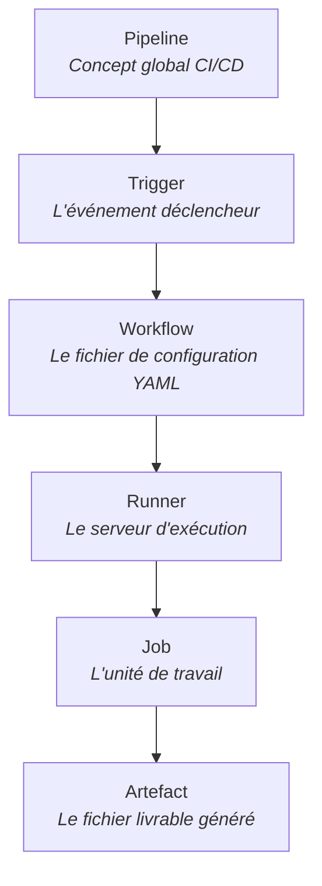

# CI_CD_BOOTSTRAP_EPI_07-04
Bootstrap Epitech 

## utiles : 

Compatibilité : Assurez-vous que votre version de Node.js est compatible (0.10+ pour Express 4.x, 18+ pour Express 5.x)

Pour initier le projet
- npm init -y 

Pour ajouter express comme dépendance
- npm install express

On peut lancer un serveur sur la base du fichier JS
qu'on devrait relancer s'il y a des modifications faites
- node index.js par exemple

cela là on peut aussi faire en sorte que le serveur surveille les fichiers en permanence et actualise
- npx nodemon index.js

Pour que Github détecte les automatisations il faut : 
- Créer un dossier .github
- Créer un sous dossier workflows
- Un test.yml

---

Le DevOps est un mouvement visant à l'unification du développement logiciel (dev) et de l'administration des infrastructures informatiques (ops). Il se caractérise par la promotion de l'automatisation et du suivi de toutes les étapes de la création d'un logiciel.

— Wikipédia, article DevOps —

Objectif du DevOps : 

- faciliter le développement et en réduire le temps dédié;
- faciliter l'intégration et le déploiement des évolutions (nouvelles fonctionnalités, correctifs, etc.);
- faciliter le débogage;
- garantir la qualité du produit livré.

---

 Dans le monde du développement web et de la philosophie DevOps (dont la CI/CD - *Continuous Integration / Continuous Deployment* - est le cœur), ces mots reviennent en permanence. 

Pour construire un socle de connaissances solide, il ne faut pas voir ces termes comme une simple liste alphabétique, mais comme un **système logique d'emboîtement**. Voici l'essentiel pour bien comprendre, dans l'ordre chronologique de leur interaction.

### 1. Le Pipeline (Le concept global)
* **Ce que c'est :** C'est le terme générique et théorique. Un pipeline est votre **chaîne d'assemblage automatisée**. 
* **À quoi ça sert :** Il définit le chemin que prend votre code depuis le moment où vous tapez `git push` jusqu'au moment où il est déployé en production (en passant par la vérification du code, les tests automatisés, etc.).
* **En bref :** L'idée globale de l'automatisation.

### 2. Le Trigger (Le déclencheur)
* **Ce que c'est :** L'événement spécifique qui va "réveiller" votre pipeline et lui dire de se mettre au travail.
* **À quoi ça sert :** On ne veut pas que les tests tournent dans le vide. On les déclenche sous certaines conditions : quand quelqu'un pousse du code sur la branche `main`, quand une *Pull Request* est ouverte, ou même tous les soirs à minuit (via un cron).
* **En bref :** L'étincelle qui allume le moteur.

### 3. Le Workflow (Le chef d'orchestre)
* **Ce que c'est :** C'est l'**implémentation concrète** d'un pipeline dans un outil spécifique comme GitHub Actions. Techniquement, c'est un fichier de configuration (généralement en `.yml` ou `.yaml`) placé dans un dossier spécifique (ex: `.github/workflows/`).
* **À quoi ça sert :** Il décrit les règles du jeu. Il dit : *"Quand ce Trigger se produit, voici la liste des Jobs à exécuter."*
* **En bref :** Le plan d'exécution écrit.

### 4. Le Job (L'unité de travail)
* **Ce que c'est :** Un workflow est découpé en plusieurs Jobs. Un job est un ensemble d'étapes (des scripts shell ou des actions pré-packagées) qui s'exécutent de haut en bas.
* **À quoi ça sert :** Cela permet de compartimenter le travail. Par exemple, vous pouvez avoir un Job `Linter` (qui vérifie la syntaxe), un Job `TestsUnitaires`, et un Job `Deploiement`. **Point fondamental :** Par défaut, les jobs s'exécutent en *parallèle* pour gagner du temps, à moins que vous ne précisiez qu'un job dépend de la réussite d'un autre.
* **En bref :** Une grande tâche spécifique dans votre chaîne de montage.

### 5. Le Runner (La machine)
* **Ce que c'est :** Le code ne s'exécute pas par magie. Un Runner est un **serveur réel** (une machine virtuelle ou un conteneur Docker) qui va exécuter un Job. 
* **À quoi ça sert :** Fournir l'environnement (CPU, RAM, OS comme Ubuntu, Windows ou macOS) nécessaire pour faire tourner vos scripts. Vous pouvez utiliser les runners fournis gratuitement par GitHub, ou configurer votre propre serveur (Self-hosted runner) pour exécuter les jobs. Chaque Job tourne sur un Runner qui lui est propre et qui est détruit à la fin.
* **En bref :** L'ordinateur qui travaille pour vous.

### 6. L'Artefact (Le livrable)
* **Ce que c'est :** Un fichier (ou un dossier) qui est **généré** par un Job pendant son exécution. 
* **À quoi ça sert :** Puisque chaque Job s'exécute sur un Runner indépendant qui est détruit à la fin, tout ce qui a été créé est perdu. Si le Job A compile votre code web et crée un dossier `build/`, et que le Job B doit envoyer ce dossier sur un serveur, le Job A doit sauvegarder ce dossier sous forme d'"Artefact" pour que le Job B puisse le télécharger et l'utiliser.
* **En bref :** Le produit fini d'une étape qu'on veut conserver ou passer à la suite.

---

    
---

J'en suis à me documenter pour finir la suite du bootstrap j'ai trouvé ce site https://blog.stephane-robert.info/docs/pipeline-cicd/github/

